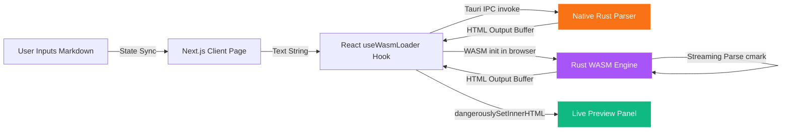

# ⚡ WasmMarkdown

> **Ultra-Fast, Offline-First Browser Markdown Editor Powered by Local Rust & WebAssembly.**

WasmMarkdown is a high-performance documentation workspace built to eliminate the typing lag, UI stutters, and main-thread freezes common to traditional JavaScript-based editors when editing large documents. By offloading Markdown parsing to a compiled WebAssembly binary written in Rust, it delivers instant, frame-accurate rendering directly in the browser sandbox.

---

## 🌟 Key Capabilities

*   🦀 **Native Rust Performance**: Leverages `pulldown-cmark` running inside a WebAssembly module to parse markdown at near-native speeds.
*   🚀 **Zero Main-Thread Lag**: Moves CPU-heavy parsing and HTML generation away from JavaScript execution threads, keeping the browser UI fluid and responsive at 60 FPS.
*   🔒 **100% Client-Side Privacy**: All parsing is executed locally. Your text never leaves your browser tab—completely offline, secure, and private.
*   📊 **Real-Time Parser Metrics**: Watch the Wasm engine compile documents in real time, with live performance speed metrics tracking parse times in fractions of a millisecond.
*   📦 **Dynamic Hydration**: Next.js 15 app architecture using client-only dynamic loading to fetch and initialize WebAssembly modules after the initial page layout loads.

---

## 🧠 System Architecture

The workspace splits rendering presentation and high-speed compilation:



---

## 🛠️ Repository Layout

*   [wasm-md-core/](file:///home/mixomate/work/Mixomate/opensource/WasmMarkdown/wasm-md-core): The native Rust library — compiles to both WebAssembly (for web) and native `rlib` (for Tauri desktop).
    *   [src/lib.rs](file:///home/mixomate/work/Mixomate/opensource/WasmMarkdown/wasm-md-core/src/lib.rs): Rust entry point wrapping `pulldown-cmark`.
    *   [Cargo.toml](file:///home/mixomate/work/Mixomate/opensource/WasmMarkdown/wasm-md-core/Cargo.toml): Cargo configuration with `crate-type = ["cdylib", "rlib"]`.
*   [wasm-md-web/](file:///home/mixomate/work/Mixomate/opensource/WasmMarkdown/wasm-md-web): Next.js frontend workspace.
    *   [src/hooks/useWasmLoader.ts](file:///home/mixomate/work/Mixomate/opensource/WasmMarkdown/wasm-md-web/src/hooks/useWasmLoader.ts): Environment-aware loader — uses Tauri native IPC in desktop, falls back to WASM in browser.
    *   [src/app/page.tsx](file:///home/mixomate/work/Mixomate/opensource/WasmMarkdown/wasm-md-web/src/app/page.tsx): Split-screen dark-mode editor dashboard.
    *   [src/app/globals.css](file:///home/mixomate/work/Mixomate/opensource/WasmMarkdown/wasm-md-web/src/app/globals.css): Tailwind and custom Markdown preview styles.
    *   [src-tauri/](file:///home/mixomate/work/Mixomate/opensource/WasmMarkdown/wasm-md-web/src-tauri): Tauri 2 desktop shell — exposes `parse_markdown` native IPC command.
        *   [src-tauri/src/lib.rs](file:///home/mixomate/work/Mixomate/opensource/WasmMarkdown/wasm-md-web/src-tauri/src/lib.rs): Tauri command handler calling `wasm_md_core::render_markdown_to_html`.
        *   [src-tauri/tauri.conf.json](file:///home/mixomate/work/Mixomate/opensource/WasmMarkdown/wasm-md-web/src-tauri/tauri.conf.json): Tauri app config (bundle ID: `com.wasmmarkdown.app`).
*   [.github/workflows/](file:///home/mixomate/work/Mixomate/opensource/WasmMarkdown/.github/workflows): CI/CD pipelines — all triggered by version tags (`v*`).
    *   [auto-release.yml](file:///home/mixomate/work/Mixomate/opensource/WasmMarkdown/.github/workflows/auto-release.yml): **Orchestrator** — auto-increments version tag on push to `release` branch, triggering all builds.
    *   [deploy.yml](file:///home/mixomate/work/Mixomate/opensource/WasmMarkdown/.github/workflows/deploy.yml): GitHub Pages web deployment.
    *   [tauri-windows.yml](file:///home/mixomate/work/Mixomate/opensource/WasmMarkdown/.github/workflows/tauri-windows.yml): Windows `.msi` / `.exe` release builder.
    *   [tauri-linux.yml](file:///home/mixomate/work/Mixomate/opensource/WasmMarkdown/.github/workflows/tauri-linux.yml): Linux `.deb` / `.rpm` / `.AppImage` release builder.
    *   [tauri-macos.yml](file:///home/mixomate/work/Mixomate/opensource/WasmMarkdown/.github/workflows/tauri-macos.yml): macOS `.dmg` / `.app` builder (manual trigger only — disabled for auto releases).

---

## 🚀 Local Quickstart

### Prerequisites
*   [Rust & Cargo](https://www.rust-lang.org/tools/install)
*   [wasm-pack](https://rustwasm.github.io/wasm-pack/installer/) (`npm install -g wasm-pack` or via shell installers)
*   [Node.js (v18+) & npm](https://nodejs.org/)

### 1. Compile the WASM Core
Compile the Rust library to a target WebAssembly module:
```bash
cd wasm-md-core
wasm-pack build --target web --release
```

### 2. Copy WASM Assets to Next.js Workspace
Integrate the generated assets into your web app:
```bash
# From workspace root
mkdir -p wasm-md-web/src/wasm wasm-md-web/public/wasm
cp wasm-md-core/pkg/wasm_md_core.js wasm-md-web/src/wasm/
cp wasm-md-core/pkg/wasm_md_core.d.ts wasm-md-web/src/wasm/
cp wasm-md-core/pkg/wasm_md_core_bg.wasm wasm-md-web/public/wasm/
```

### 3. Launch the Web Workspace
Install dependencies and boot up the Next.js development server:
```bash
cd wasm-md-web
npm install
npm run dev
```
Open [http://localhost:3000](http://localhost:3000) to view your local high-performance workspace.

---

## 🌐 Production Deployment

We use **GitHub Actions** to automate compilation and deployment for both the web interface and native desktop platforms. This repository is configured with **4 separate workflows**:

1. **Web Deployment** ([deploy.yml](file:///.github/workflows/deploy.yml)): Compiles the WASM core, builds the Next.js static asset tree, and deploys it live to GitHub Pages.
   * *Triggers*: Automatically when version tags (`v*`) are pushed/updated (disabled on direct branch pushes).
2. **Windows Desktop App** ([tauri-windows.yml](file:///.github/workflows/tauri-windows.yml)): Compiles native Windows binary and bundles `.msi` / `.exe` installer.
   * *Triggers*: Automatically when version tags (`v*`) are pushed/updated.
3. **macOS Desktop App** ([tauri-macos.yml](file:///.github/workflows/tauri-macos.yml)): Compiles Apple Silicon + Intel universal `.dmg` / `.app` bundles.
   * *Triggers*: **Manual only** — disabled for automatic tag releases. Run from the GitHub Actions tab when needed.
4. **Linux Desktop App** ([tauri-linux.yml](file:///.github/workflows/tauri-linux.yml)): Compiles and bundles `.deb`, `.rpm`, and `.AppImage` packages.
   * *Triggers*: Automatically when version tags (`v*`) are pushed/updated.

### Triggering Release Builds (All Platforms)

All builds are orchestrated automatically by pushing to the **`release` branch**. A dedicated [auto-release.yml](file:///.github/workflows/auto-release.yml) workflow handles the entire flow:

1. Merge your changes into the `release` branch and push:
   ```bash
   git checkout release
   git merge main
   git push origin release
   ```
2. The `auto-release.yml` workflow runs automatically. It reads the latest tag (e.g. `v1.0.1`), computes the next version (`v1.0.2`), and pushes the new tag.
3. The new tag immediately triggers the 3 build workflows in parallel:
   * 🌐 **Web Deploy** → updates GitHub Pages
   * 🪟 **Windows Build** → creates `.msi` / `.exe` installer
   * 🐧 **Linux Build** → creates `.deb` / `.rpm` / `.AppImage`
4. All installers are uploaded to a new **Draft Release** on GitHub. Review and publish when ready.

> [!NOTE]
> The **macOS build** ([tauri-macos.yml](file:///.github/workflows/tauri-macos.yml)) is disabled for automatic releases. Run it manually from the **Actions** tab on GitHub if needed.

### Static Export Hosting (Vercel, Netlify, etc.)
This application utilizes a Next.js static export (`output: 'export'`). To deploy on other services, configure the framework build settings to run the following build script to compile the Wasm binaries:
```bash
cd wasm-md-core && curl https://rustwasm.github.io/wasm-pack/installer/init.sh -sSf | sh && wasm-pack build --target web --release && cd ../wasm-md-web && mkdir -p src/wasm public/wasm && cp ../wasm-md-core/pkg/wasm_md_core.js src/wasm/ && cp ../wasm-md-core/pkg/wasm_md_core.d.ts src/wasm/ && cp ../wasm-md-core/pkg/wasm_md_core_bg.wasm public/wasm/ && npm run build
```

---

## 🖥️ Desktop Application (Tauri)

WasmMarkdown can also run as a native cross-platform desktop application via [Tauri 2](https://tauri.app). The `useWasmLoader` hook automatically detects whether it is running inside the Tauri desktop shell (via `window.__TAURI_INTERNALS__`) and switches to a native IPC call (`invoke('parse_markdown')`), bypassing WebAssembly entirely for maximum throughput. In a standard web browser the WASM engine is loaded as usual — no code changes are needed.

### System Prerequisites

Because Tauri compiles a native GUI binary, you must install the WebKitGTK and development libraries on your machine before compiling:

#### Debian / Ubuntu
```bash
sudo apt-get update && sudo apt-get install -y \
  libsoup-3.0-dev \
  libwebkit2gtk-4.1-dev \
  build-essential \
  curl \
  wget \
  file \
  libssl-dev \
  libgtk-3-dev \
  libayatana-appindicator3-dev \
  librsvg2-dev
```

#### Fedora
```bash
sudo dnf groupinstall -y "C Development Tools and Libraries"
sudo dnf install -y \
  libsoup3-devel \
  webkit2gtk4.1-devel \
  libappindicator-gtk3-devel \
  openssl-devel \
  librsvg2-devel
```

### Running the Desktop App

1. Navigate to the frontend directory:
   ```bash
   cd wasm-md-web
   ```
2. Start the application in development mode:
   ```bash
   npm run tauri dev
   ```
3. To package the application as a production-ready installer:
   ```bash
   npm run tauri build
   ```

---

## 📄 License

Distributed under the MIT License. See `LICENSE` for details.
